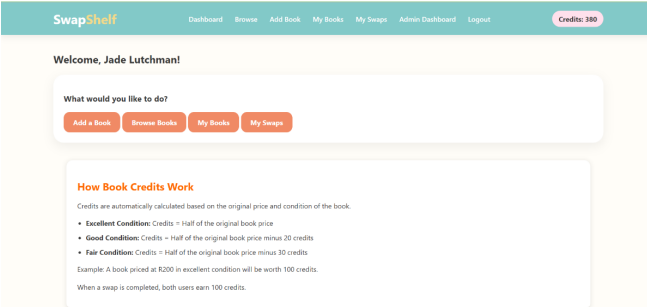

<div align="center">

# SwapShelf

### A C2C Textbook Exchange Platform

*A database-driven web application designed to make textbook exchange more accessible, structured and reliable for students.*

<br>


</div>

---

## About SwapShelf

Buying textbooks can be expensive, while students often have textbooks they no longer use.

**SwapShelf** is a C2C (customer-to-customer) textbook exchange platform that allows students to list textbooks, browse books offered by other users and request exchanges through a credit-based swapping system.

The project was developed as part of my BSc Computer Science studies and gave me practical experience in building a database-driven web application using PHP and MySQL.

---

## Technologies Used

| Technology | Purpose |
|---|---|
| **PHP** | Server-side application logic |
| **MySQL / SQL** | Database storage and queries |
| **HTML** | Website structure |
| **CSS** | Interface design and responsive styling |
| **JavaScript** | Client-side interactions |
| **XAMPP** | Local development environment |

---

## Key Features

- User registration and authentication
- Add and manage textbook listings
- Browse and search available textbooks
- Request textbook swaps
- Credit-based swapping system
- Manage incoming and outgoing requests
- Approve and complete swaps
- User dashboard
- Administrator dashboard
- User and textbook management

---

## Application Preview

### Landing Page

The landing page introduces SwapShelf and provides users with options to register or log in.


<br>

### User Dashboard

The dashboard provides logged-in users with access to the main SwapShelf features and displays their available book credits.



<br>

### Browse Textbooks

Users can browse available textbooks and search for books listed by other students.


<br>

### My Swaps

Users can view and manage incoming and outgoing textbook swap requests.


<br>

### Admin Dashboard

The administrator dashboard provides an overview of platform activity and access to user and textbook management functionality.


---

## What I Learned

Through the development of SwapShelf, I gained practical experience in:

- Building a database-driven web application
- Connecting PHP applications to MySQL
- Writing and working with SQL queries
- Implementing user authentication and sessions
- Developing CRUD functionality
- Working with relational database structures
- Implementing application business logic
- Creating responsive interfaces
- Debugging and testing web application functionality

---

## Project Structure

```text
SwapShelf/
├── css/
├── docs/
│   └── screenshots/
├── includes/
├── uploads/
├── index.php
├── login.php
├── register.php
├── dashboard.php
├── browse_books.php
├── add_book.php
├── my_books.php
├── my_swaps.php
└── admin_dashboard.php
```

---

<div align="center">

### Academic Project

Developed as part of my **BSc Computer Science** studies.

**Jade Lutchman**

</div>
